# 🛍️ Plexora - A Modern MERN Stack eCommerce Platform
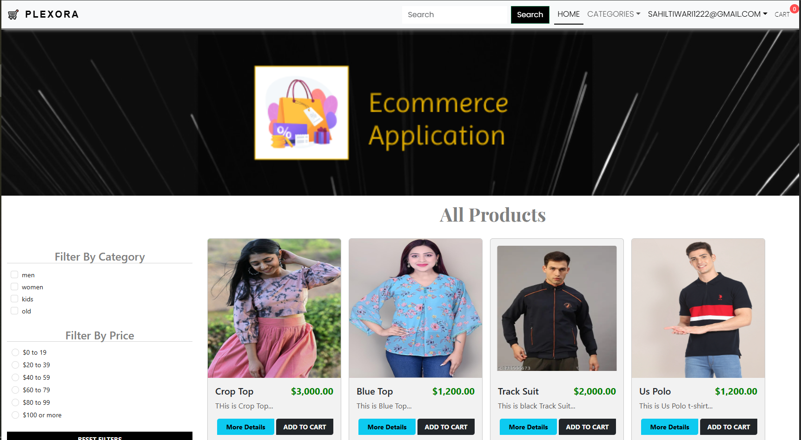

**Plexora** is a feature-rich, full-stack eCommerce application built using the **MERN** stack – MongoDB, Express.js, React.js, and Node.js. Designed with both performance and scalability in mind, Plexora delivers a seamless shopping experience for customers and a powerful admin interface for business owners to manage products, users, and orders efficiently.

---
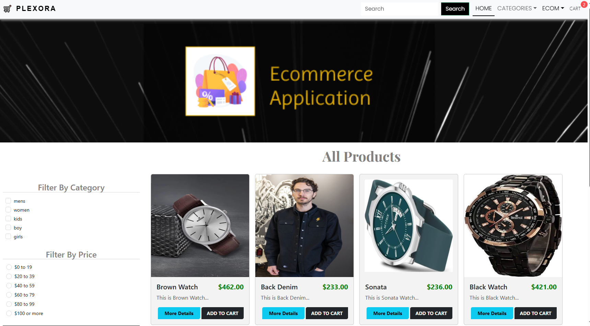


## 🚀 Features

- **Product Management** – Add, edit, delete products and organize them by category.
- **Admin Dashboard** – Manage users, view orders, update product info, and access real-time sales analytics.
- **Secure Checkout** – Integrated with Stripe for smooth and secure payments.
- **User Authentication** – Register/login system with role-based access (User/Admin).
- **Shopping Cart** – Dynamic cart functionality with persistent storage.
- **Search & Filter** – Real-time product search and filter options.
- **Mobile Responsive** – Fully optimized for phones, tablets, and desktops.
- **Image Upload Support** – Admin can upload product images using `Multer`.
- **Notifications** – Toast-based alerts for actions and events.
- **Order Management** – View and track orders with status updates.

---
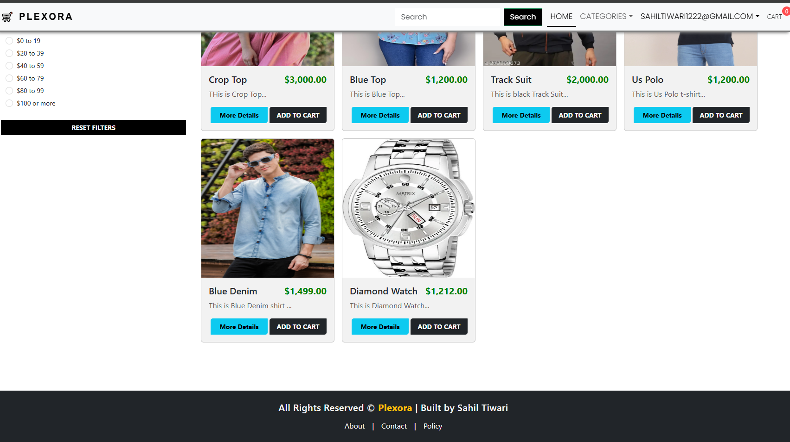

## 🛠️ Tech Stack

### Frontend:
- React.js
- Axios
- Context Api
- React-Router-DOM
- React-Toastify
- Bootstrap/ Custom Styling

### Backend:
- Node.js
- Express.js
- MongoDB with Mongoose
- JWT for authentication
- Multer for file/image uploads
- Bcrypt.js for hashing passwords
- BrainTree API for payments

---


## 🖼️ Screenshots

| Screen | Preview |
|--------|---------|
| 🏠 Homepage |  |
| 🖼️ Front Page |  |
| 🛍️ All Products | 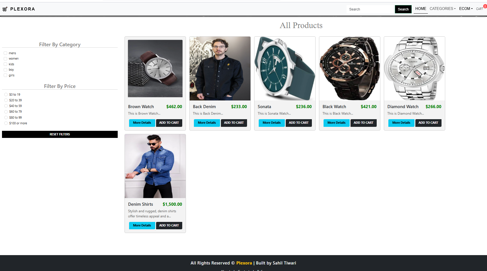 |
| 🛒 Cart Page | 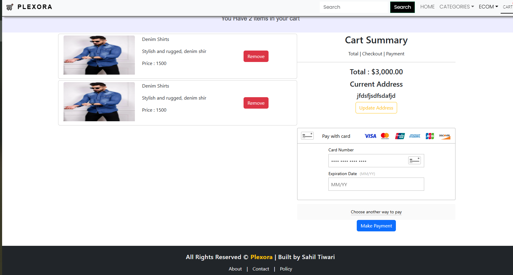 |
| 📞 Contact Plexora |  |
| 📇 Create Category |  |
| 📝 Create Product | 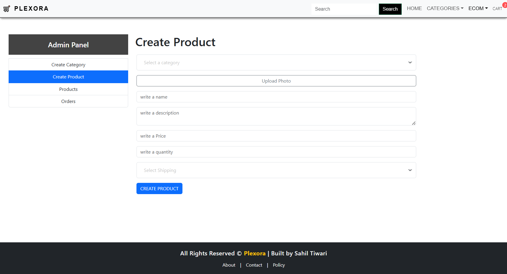 |
| 🛡️ Privacy Policy | 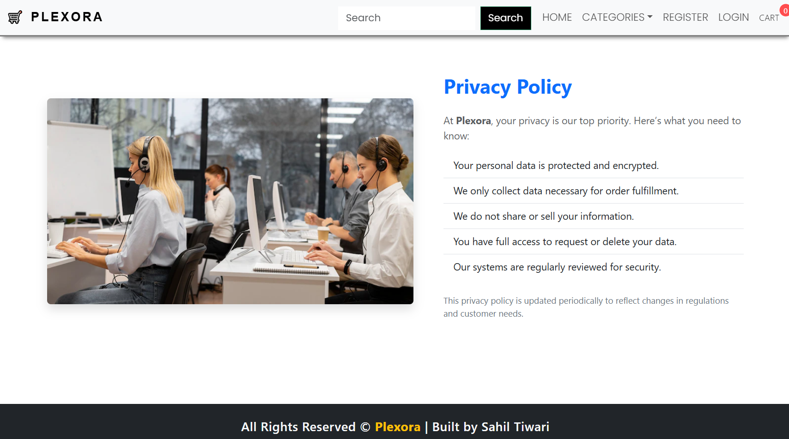 |
| 📦 Product Details | 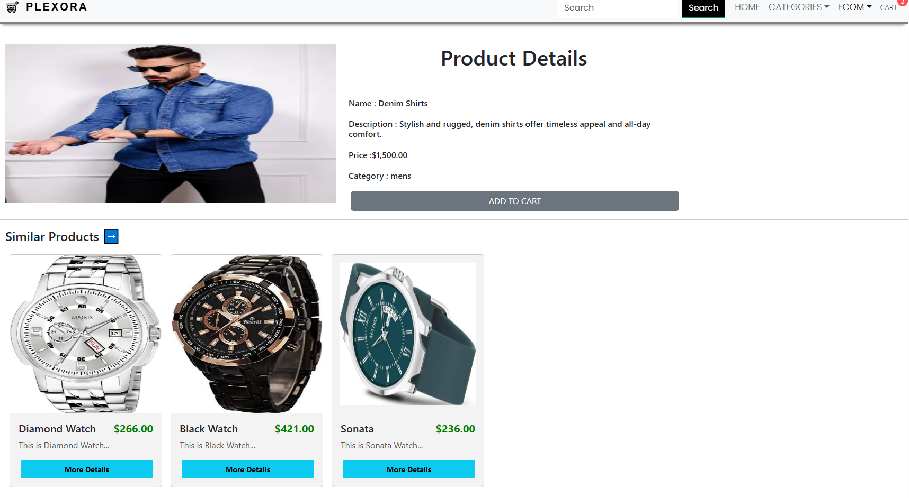 |
| 👤 Register Page | 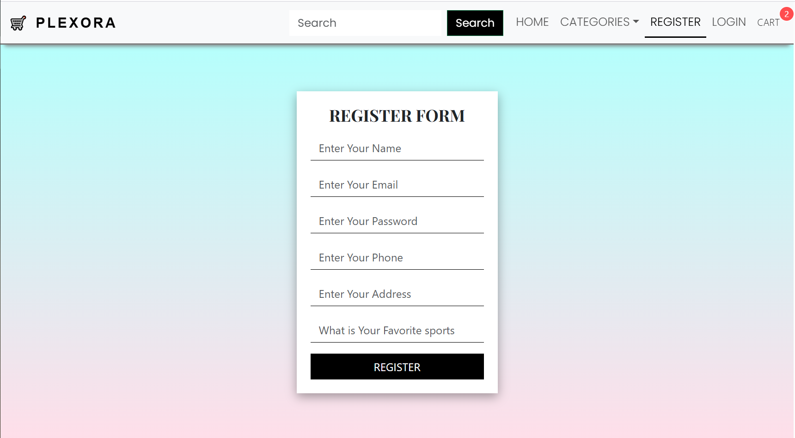 |
| 🔎 Search Functionality | 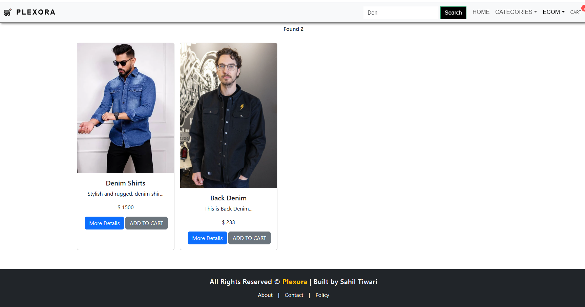 |
| 📤 Admin Product Upload | 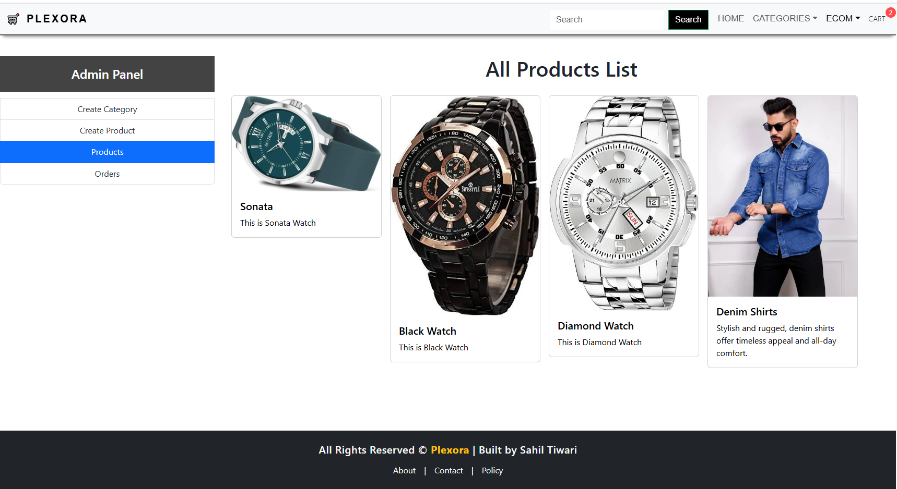 |


---

## 🏗️ Installation & Setup Guide

Follow these steps to get Plexora running locally:

### 1. Clone the repository
```bash
git clone https://github.com/yourusername/plexora.git
cd plexora
```

### 2. Install Frontend Dependencies
```bash
cd frontend
npm install
```

### 3. Install Backend Dependencies
```bash
cd ../backend
npm install
```

### 4. Setup Environment Variables

In the `backend` directory, create a `.env` file and add the following:

```
MONGO_URI=your_mongodb_connection_string
JWT_SECRET=your_jwt_secret
STRIPE_SECRET_KEY=your_stripe_key
```

### 5. Run the Backend Server
```bash
npm run server
```

### 6. Run the Frontend
```bash
cd ../frontend
npm start
```

---

## 🌟 Key Packages

| Package | Purpose |
|--------|---------|
| `Axios` | Handles API requests |
| `React-Toastify` | Displays user notifications |
| `Context Api` | Global state management |
| `Multer` | Image upload support |
| `BrainTree` | Payment gateway integration |
| `JWT` | Token-based authentication |
| `bcryptjs` | Secure password hashing |

---

## 📁 Directory Structure

```
plexora/
├── backend/
│   ├── controllers/
│   ├── models/
│   ├── routes/
│   ├── middleware/
│   └── .env
├── frontend/
│   ├── components/
│   ├── pages/
│   ├── redux/
│   └── App.js
├── screenshots/
│   └── (14 image files)
└── README.md
```

---

## 📸 Additional Screenshots


| Screen | Preview |
|--------|---------|
| 🛍️ Product Page |  |
| 🧑 Admin Product Management |  |
---

## 🎯 Future Enhancements

- ✅ Add product reviews and rating system
- 📧 Email notifications on order updates
- 🔍 Advanced product filtering (price range, availability, brand)
- 💬 Integrate chatbot for customer support
- 📦 Inventory alerts and restocking system
- 🌍 Multilingual support for global users

---

## 👨‍💻 Author

**Sahil Tiwari**  
Frontend & Full-Stack MERN Developer  
📬 [samrattiwari156@gmail.com](mailto:samrattiwari156@gmail.com)  
🔗 [GitHub Profile](https://github.com/sahilTiwariiii)  

---

## 📌 License

This project is licensed under the MIT License - feel free to use and contribute!
